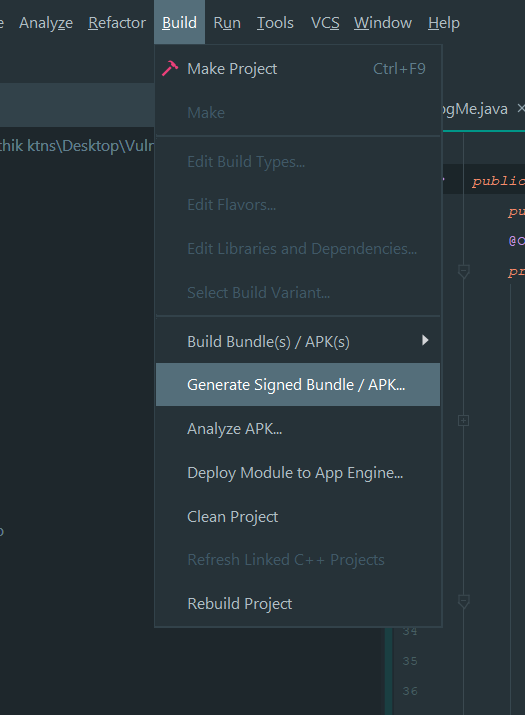
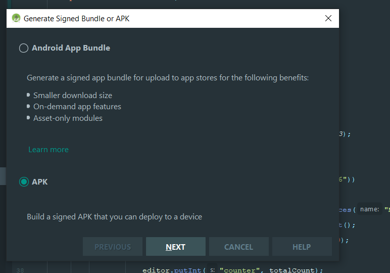
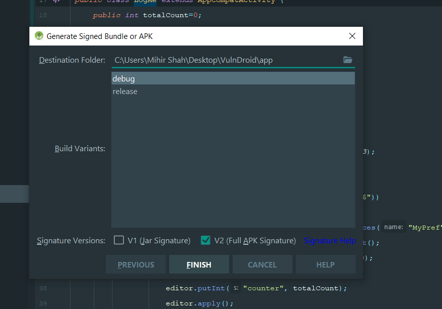
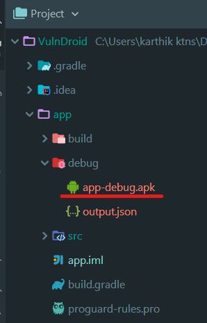
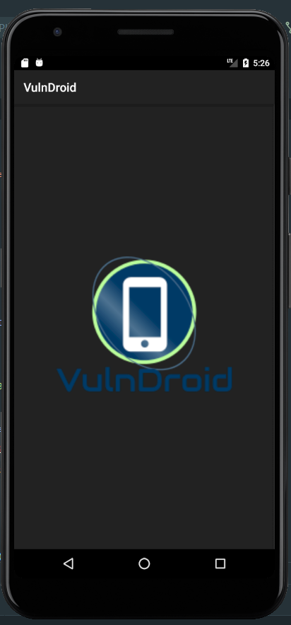

 

  
# VulnDroid - The Vulnerable Android App
  
  <b>VulnDroid</b> is a <i>Vulnerable Android App</i> designed in a CTF challenge style, it focuses on learning the exploitation of Android vulnerabilities pertaining to Local Storage, i.e. In-The-App malpractices by the developers. This playground has a total of Eight levels- with more to come. The attacker will have knowledge of the victim and will send a crafted payload, to read the flag and enter it within the app, on entering the correct flag, the user is greeted with a Congratulations page.
    The attacker only completes the challenge on successful validation of the flag. 

# Levels in the App
1. Hardocding Details
2. Insecure Logging
3. Insecure Database
4. Sensitive info in Android VCS
5. Insecure Shared Preferences
6. Sensitive info within function calls
7. Insecure External Storage
8. Insecure Internal Storage
    
> This also teaches the practice of secure coding. 
> The developer can observe the source code and understand that the flag value is stored in an encrypted format and only the hash of the user input flag is stored.
> The validated is also carried out only by comparing the hash values. 
> This makes the Source code quite difficult to reverse from the bundled APK 
> even in absence of any obfuscation tool like ProGuard

# Steps for installation
1. Open the Project in Android Studio
2. Generate the VulnDroid APK by selecting `Build` -> `Generate Signed Bundle/ APK...` in Android Studio

3. Select The APK option in the wizard.

4. Enter the Keystore path, Incase you don't have a keystore- create one using the on-screen options

5. Select the debug option in the next screen

6. Obtain the VulnDroid APK from the relative path `app/release/app-debug.apk`

7. Create an [Android Emulator](https://developer.android.com/studio/run/managing-avds)
    *Note:* The emulator used during the testing of VulnDroid had this [Configuration](app/src/main/res/drawable/config.txt)
8. Install the VulnDroid APK obtained from the above step into the Android Emulator and run the following command
    `adb install app-debug.apk`

## The App 
1. The app starts up 

2. The Main Activity screens shows up next

3. On this screen you can start with any level that you wish and try hunting the vulnerabilities with a hint in the title of that activity.
4. On finding the flag, enter it within the text box of the same activity and on successful finding, you would be greeted with a congratulations page.😊

## Future Updates
 This App is only pertaining to the challenges and the exploitabiliy of the localstorage options. In the upcoming series of app releases, other dynamic analysis challenges would also be released. 

## Contribute
 In case of any Bugs create an issue and to add any functionality to this app send a Pull Request.

## Todo
1. Create more levels on for this App
2. Minor changes for the UX of the app
3. Create another app for android testing on Web hooking, Dynamic testing, etc.

